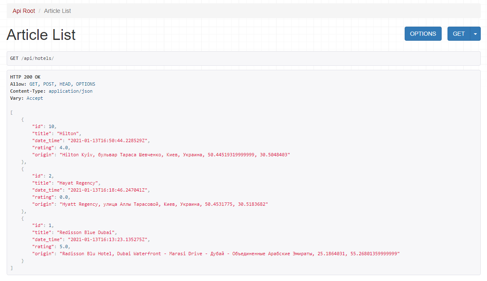
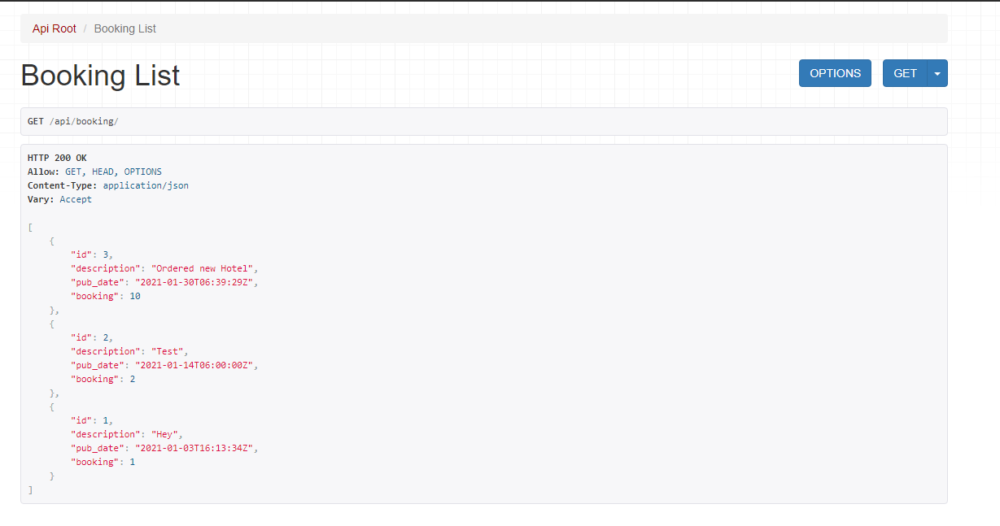

First Launch:

1. Clone repo
2. Install env packages:
    - pip install django
    - pip install djangorestframework
3. Run following commands:
    - python manage.py migrate
    - python manage.py createsuperuser (create user for admin panel)
    - python manage.py runserver (launch server)

API was built with Django Rest Framework

Note: to test map API you need to switch page to admin https://django-app-booking.herokuapp.com/admin (note: the same pass as endpoint url)

1. Data based on ORM
2. Used Google Maps API as place determination by origin
3. Created two models with hotels and booking (as list)

Testing:

To test functionality goto https://django-app-booking.herokuapp.com/api/hotels

Usage/methods: 

* /api/hotels/{id} -> int 
- return str id as pk (primary key)

/api/hotels/{title} -> str 
- return str title

/api/hotels/{origin} -> str 
- return str with coordinates from Google API

/api/hotels/{date_time} -> str 
- return datetime in unicode

/api/hotels/{rating} -> float 
- return float value

/api/hotels/{is_published} -> boolean 
- return boolean value

    

1. This endpoint using 4 methods GET/POST/PUT/DELETE
2. You can add your origin and hotel by desire (preferable to do it in django admin panel)
3. POST/PUT Method to add/update post id data

To Check booking list go by  https://django-app-booking.herokuapp.com/api/booking

1. This endpoint using 1 method - GET
2. Extracting all bookings via GET method

Usage/methods: 

/api/bookig/{id} -> int 
- return str id as pk (primary key)
/api/hotels/{title} -> str
- return str title 
/api/hotels/{description} -> str
- return str description 
/api/hotels/{booking} -> mixed 
- return values from foreign key hotels
